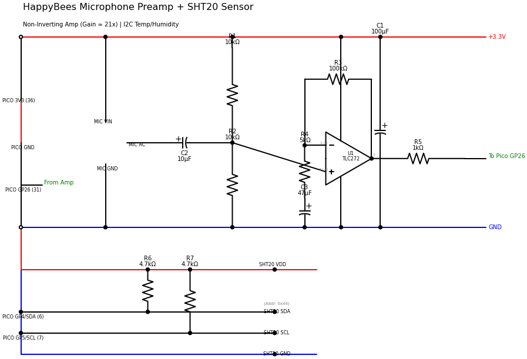

# HappyBees Wiring Guide

This guide covers the hardware connections for the HappyBees beehive monitor.

  

## Components

| Part | Description | Qty |
|------|-------------|-----|
| Pico 2 W | Raspberry Pi Pico 2 W | 1 |
| SPW2430 | MEMS Microphone | 1 |
| TLC272 | Dual Op-Amp | 1 |
| SHT20 | I2C Temp/Humidity Sensor | 1 |
| R1, R2 | 10kΩ Resistor | 2 |
| R3 | 100kΩ Resistor | 1 |
| R4 | 5kΩ Resistor | 1 |
| R5 | 1kΩ Resistor | 1 |
| R6, R7 | 4.7kΩ Resistor (I2C pull-ups) | 2 |
| C1 | 100µF Electrolytic | 1 |
| C2 | 10µF Electrolytic | 1 |
| C3 | 47µF Electrolytic | 1 |

## Pico 2 W Connections

| Pico Pin | GPIO | Function | Connects To |
|----------|------|----------|-------------|
| 36 | 3V3 | Power | VCC Rail |
| 38 | GND | Ground | GND Rail |
| 31 | GP26 | ADC0 | Preamp Output (R5) |
| 6 | GP4 | I2C0 SDA | SHT20 SDA + R6 |
| 7 | GP5 | I2C0 SCL | SHT20 SCL + R7 |

## Microphone Preamp

The SPW2430 MEMS mic feeds a non-inverting amplifier (gain ≈ 21x):

1. **Mic** → AC-coupled via C2 (10µF) → Op-amp (+) input
2. **Bias**: R1/R2 voltage divider sets 1.65V DC bias at (+) input
3. **Gain**: Set by R3/R4 ratio: `Gain = 1 + (R3/R4) = 1 + (100k/5k) = 21`
4. **Output**: Filtered through R5 (1kΩ) → GP26 (ADC)

## I2C Sensor (SHT20)

| SHT20 Pin | Connects To |
|-----------|-------------|
| VDD | 3.3V |
| GND | GND |
| SDA | GP4 + 4.7kΩ pull-up to 3.3V |
| SCL | GP5 + 4.7kΩ pull-up to 3.3V |

**I2C Address:** `0x44`

## Power

- All components powered from Pico 3.3V rail
- C1 (100µF) provides power supply decoupling near the op-amp

## Notes

- Use short wires for mic connections to minimize noise
- Keep I2C wires under 30cm for reliable communication
- After assembly, calibrate gain with serial command `g0.35` (adjust as needed)